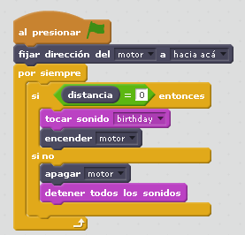

# Animadores

## Objetivo

Interacción con el sensor distancia y conversión de movimiento rotatorio con oscilante

## Construcción

En[ formato PDF](http://ro-botica.com/pdf/WeDo/Cheering%20Fans.pdf) o en [Dropbox](https://www.dropbox.com/s/e7o1g4g8gigeaag/ANIMADORES.pdf?dl=0)

## Propuesta

Si ponemos un obstáculo delante del sensor, los animadores empiezan a bailar:

https//www.youtube.com/watch?v=bUR5CcVPD4A

%accordion%Retroalimentación%accordion%

Se ha añadido un poco de música para animar más:

%/accordion%