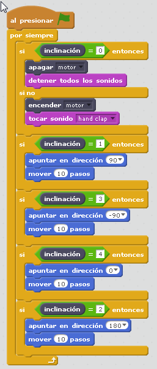

# Avión

## Objetivos

Se trabaja la interacción con Scratch, especialmente el control del movimiento y el sensor de posición

## Construcción

Aquí en[ formato PDF](https://a248.e.akamai.net/cache.lego.com/r/education/r/lesi/-/media/lesi/downloads/building%20instructions/wedo/9580_airplanerescue.pdf?l.r2=-511924109) o en [Dropbox](https://www.dropbox.com/s/u52hlt3dhe06ys8/AVION%20RESCATE.pdf?dl=0)

## Propuesta

Realizar el movimiento de un avión según el valor del sensor de desplazamiento, con movimiento de la hélice del avión y sonido (ya que estamos! )

https//www.youtube.com/embed/VSClG9h6L9c
<input type="button" name="toggle-feedback-25_93" value="Solución" class="feedbackbutton" onclick="$exe.toggleFeedback(this,false);return false" />

### Retroalimentación

[Aquí te puedes descargar el programa](avion.sb2) (sb2 - 17650 <abbr lang="en" title="Bytes">B</abbr>).

