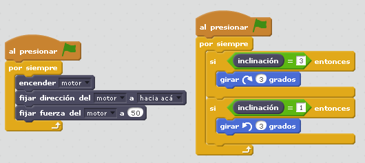

# Barco

## Objetivo

- Aprender los mecanismos de transformación de movimiento rotatorio del motor al ondulatorio del barco
- Programación interactiva del sensor de rotación con un objeto de Scratch

## Construcción

Aquí en [formato PDF](http://ro-botica.com/pdf/WeDo/Sail%20Boat%20Storm.pdf) o aquí en [Dropbox](https://www.dropbox.com/s/0nxfaw204ctabqn/VELERO.pdf?dl=0)

## Propuesta

Realizar la construcción del barco navegante, y también otro en el Scratch, los dos se deben de mover sincronizados gracias al sensor de inclinación colocado en el casco del barco

https//www.youtube.com/embed/oHD47bO8t48
<input type="button" name="toggle-feedback-28_93" value="Solución" class="feedbackbutton" onclick="$exe.toggleFeedback(this,false);return false" />

### Retroalimentación

Son dos programas, uno que mueve el motor y otro que gira el objeto del Scratch según el sensor inclinación

Se podría hacer todo en un bucle

[Te lo puedes descargar aquí ](barco_navegando.sb2) (sb2 - 274.12 <abbr lang="en" title="KiloBytes">KB</abbr>).

