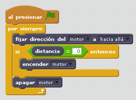

# Chutador a gol

## Objetivo

Se busca una interacción fácil entre el sensor distancia y el motor.

## Construcción

Aquí en [formato PDF ](http://ro-botica.com/pdf/WeDo/Goal%20Kicker.pdf)

## Propuesta

La propuesta es fácil de adivinar ¿no? :

https//www.youtube.com/embed/jE4jhXm3YF0
<input type="button" name="toggle-feedback-30_93" value="Solución" class="feedbackbutton" onclick="$exe.toggleFeedback(this,false);return false" />

### Retroalimentación

