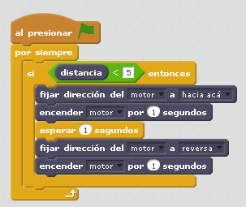

# Cocodrilo hambriento

## Objetivo

Es sin duda la construcción que identifica este set de Lego. Se trata de un cocodrilo que tiene que abrir o cerrar la boca interactuando con el objeto que se encuentre en la boca. Aquí se trabaja:

- la entrada de un sensor
- la interacción que produce de forma real cerrando la boca
- Otras interacciones podrían ser de forma virtual: Personaje cocodrilo abriendo y cerrando la boca con sonido incorporado

## Construcción

En[ este enlace ](http://ro-botica.com/pdf/WeDo/Hungry%20Alligator.pdf)tenemos el pdf o en este otro [en Dropbox ](https://www.dropbox.com/s/t0dnpnfr580mxj3/COCODRILO.pdf?dl=0)

## Propuesta

De momento el enunciado que proponemos será que cierre la boca si se introduce un objeto y al cabo de 1 segundo que la abra para poder liberar el objeto:

https//www.youtube.com/embed/VX8i0Pg9DxE
<input type="button" name="toggle-feedback-1_93" value="Mostrar retroalimentación" class="feedbackbutton" onclick="$exe.toggleFeedback(this,true);return false" />

### Retroalimentación

## Otra propuesta

Que no pare de masticar mientres esté el objeto

https//www.youtube.com/embed/vbzcMDYyoRk
<input type="button" name="toggle-feedback-7_93" value="Mostrar retroalimentación" class="feedbackbutton" onclick="$exe.toggleFeedback(this,true);return false" />

### Retroalimentación

Fuente[ http://www.simonhaughton.co.uk/2010/06/lego-wedo-and-scratch.html](http://www.simonhaughton.co.uk/2010/06/lego-wedo-and-scratch.html)

## Otra propuesta

Que el caiman cierre y abra la boca varias veces cuando detecte un objeto

<input type="button" name="toggle-feedback-6_93" value="Mostrar retroalimentación" class="feedbackbutton" onclick="$exe.toggleFeedback(this,true);return false" />

### Retroalimentación

Fuente [Codigo 21](http://codigo21.educacion.navarra.es/autoaprendizaje/primeros-pasos-con-scratch-y-lego-wedo/)

Programa compartido por código 21 [en este enlace](https://scratch.mit.edu/projects/82780984/)

