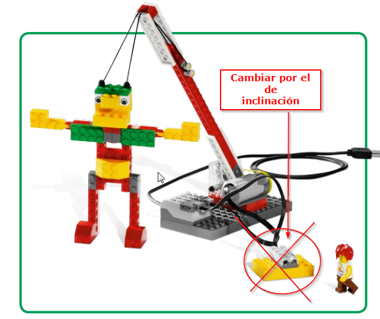
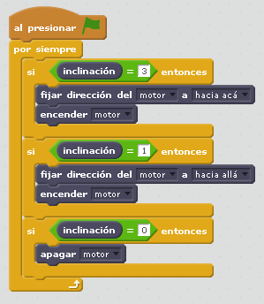

# Gigante colgante

## Objetivo

En esta construcción se trabajan dos aspectos:

- Los mecanismos de transformación del movimiento giratorio en un multiplicador de fuerza como es el tornillo sinfin
- La programación interactuando con el sensor de inclinación

## Construcción

Aquí en [formato PDF](http://ro-botica.com/pdf/WeDo/Giant%20Escape.pdf) o aquí en [Dropbox](https://www.dropbox.com/s/3vtqkwv6iukb2fp/GIGANTE.pdf?dl=0), pero CON UNA OBSERVACIÓN aconsejamos utilizar el sensor **inclinación** en lugar del de distancia ¿por qué? porque hemos experimentado que el control de la grúa con el sensor distancia es muy difícil, no sólo en programación, sino también en sensibilidad, provocando que la grúa se pase de los límites de construcción (por ejemplo que baje más bajo que la horizontal) y provoca que las piezas sufran tensión saltando la construcción. 

[Aunque a estos les ha ido bien con el de proximidad](https://www.youtube.com/watch?v=d4Mc-TG5i9M).

Otra cosa: Si no se construye bien, el motor va frenado y no va.

## Propuesta

Nuestra propuesta como hemos advertido antes es utilizando el sensor inclinación: Según su valor inclinado hacia arriba o hacia abajo, así actua la grua levantando al gigante:

https//www.youtube.com/watch?v=0JXhyMYaL_g

%accordion%Solución%accordion%

La puedes descargar [aquí](http://aularagon.catedu.es/materialesaularagon2013/LegoWedo/M2/gigante.sb2) (sb2 - 54.07 <abbr lang="en" title="KiloBytes">KB</abbr>).

%/accordion%

## Otra propuesta

Levantarlo con el teclado:

https//www.youtube.com/watch?v=oKlWSBhQL5M
