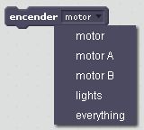
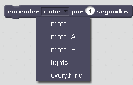
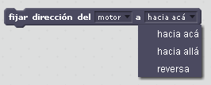

# Instrucciones LegoWedo parts

## **Encender motor**

* Enciende el motor
* Tenemos varias opciones, motor A o B por si tenemos dos motores conectados
  \(A o B según donde estén conectado en la interface, ver última fila\)
* Si tuvieramos LegoWedo, también tiene luces
  pero en este curso lo omitimos

## Fijar fuerza del motor

* Prepara el motor a una fuerza \(equivalente a la velocidad\) determinada
* Valor mínimo 1 y máximo 100
* Esta instrucción se tiene que utilizar después de la anterior.
* Ejemplo:

## Apagar el motor

* Apaga el motor.

## Encender motor por

Permite encender el motor por un tiempo predeterminado  
Esta instrucción es equivalente a todos los sentidos a estas tres:

## Fijar dirección del motor.

Fija el sentido de giro del motor \(la traducción del español no la vemos muy acertada, pero nosotros te la traducimos ;\)

* hacia acá = sentido de las agujas del reloj
* hacia allá = sentido contrario a las agujas del reloj
* reversa = sentido contrario al indicado en la última instrucción

## Cuando inclinación sea.

* Empieza a ejecutar el programa cuando el sensor de inclinación devuelve un 1
  \(es decir, cuando inclinamos el sensor hacia abajo\)
* El 1 se puede cambiar por los cuatro valores del sensor 0-1-2-3-4
* Se puede cambiar el = por not=

Por ejemplo si ponemos :  
not= 0 entonces ejecuta el programa cuando el sensor no está en la posición horizontal.

## Cuando la distancia sea.

El programa correspondiente se ejecuta cuando el sensor detecta  
un objeto a menos de 20

Se puede cambiar el 20 por supuesto, y el símbolo &lt; por &gt;

## Distancia

Variable que devuelve el sensor distancia entre 0 y 100 \(el 0 está algo alejado del sensor\)

## Inclinación

Variable que devuelve el sensor inclinación

* 0 = Sin inclinación, horizontal
* 1 = Inclinado hacia abajo
* 2 = inclinado hacia la derecha
* 3 = inclinado hacia arriba
* 4 = inclinado hacia la izquierda

