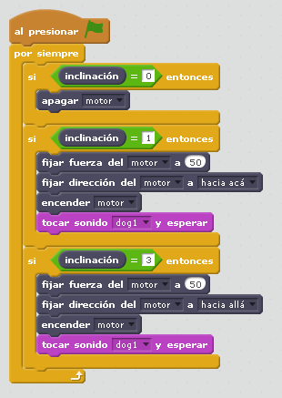

# León

## Objetivo

Trabajar el sensor de inclinación con la interacción de una construcción

## Construcción

En [formato PDF](http://ro-botica.com/pdf/WeDo/Roaring%20Lion.pdf) y en [Dropbox](https://www.dropbox.com/s/xqtasq2tg4yijpf/LEON.pdf?dl=0)

## Propuesta

Realizar un programa que al inclinar el sensor de inclinación, el león se levante y ruga. Al inclinarlo hacia abajo, el león se tumbe:

https//www.youtube.com/watch?v=aQSpXdlQeG4

%accordion%Solución%accordion%

La solución te lo puedes [descargar aquí](http://aularagon.catedu.es/materialesaularagon2013/LegoWedo/M2/leon.sb2) (sb2 - 61.34 <abbr lang="en" title="KiloBytes">KB</abbr>). y el código es el siguiente:

se ha reducido la velocidad pues iba muy rápido y desmontaba la construcción

_y sí... ya sé que no es un rugido, es un ladrido, pero no hay otra cosa en la biblioteca, y mi voz no es muy grave_

%/accordion%

## Propuesta

La idea es de [esta página web](http://dunbit.blogspot.com.es/2014/12/aprender-leon-lego-scratch-robotica.html), propone poner el sensor distancia en el hocico

De esta manera ya le podemos dar más interacción: Si hay un objeto, se sienta, lanza un rugido y se vuelve a tumbar

https://www.youtube.com/watch?v=_IbYoL0eTvw

%accordion%Solución%accordion%

O aquí en Scratch:[ https://scratch.mit.edu/projects/38093952/](https://scratch.mit.edu/projects/38093952/)

<iframe width="485" height="402" allowtransparency="true" src="//scratch.mit.edu/projects/watch?v=38093952/?autostart=false" frameborder="0" allowfullscreen=""></iframe>

%/accordion%
