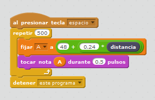

# Matemáticas, música y Lego

## Propuesta musical

Realizar un programa que según la distancia toque una nota 

Hay que convertir el valor que devuelve el sensor (vamos a llamarlo **distancia** de 0 a 100) en un valor nuevo (**A**, de 48 a 72).

El valor 48 corresponde a la nota DO en una escala grave y el valor 72 a la nota Do

Fuente [LabDocente](http://labdocente.pe/2016/01/19/robotica-con-lego-wedo-el-sensor-de-distancia/)

https//www.youtube.com/watch?v=fhqpWvoDte0
**No te rias! no sé tocar el piano !!! (el autor)**

%accordion%Solución%accordion%

Aquí entran en juego las matemáticas:

La ecuación entre **A** y **distancia** corresponde a una proporción directa, es decir a una línea recta, con corte de ordenada **m** y pendiente **n** :

A = m + n*distancia

- Para A=48 y distancia=0 tenemos que **m=48**
- Para A=72 y distancia=100 tenemos que **n =** (72-48)/100=** 0.24**

Luego **A= 48 + 0.24*distancia**

[Descarga del programa](piano.sb2) (sb2 - 54.09 <abbr lang="en" title="KiloBytes">KB</abbr>).

Fuente [LabDocente](http://labdocente.pe/2016/01/19/robotica-con-lego-wedo-el-sensor-de-distancia/)

%/accordion%

## Fonografo

Otra alternativa es construir un toca-discos de manera casera, para que los alumnos también comprendan el funcionamiento de los reproductores de vinilo

https//www.youtube.com/watch?v=yj-X21rgOuw

%accordion%Solución%accordion%

La construcción paso a paso está en la siguiente página [http://makezine.com/projects/make-35/lego-phonograph/](http://makezine.com/projects/make-35/lego-phonograph/)

%/accordion%
