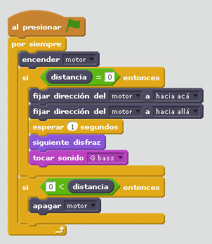

# Mono percusionista

## Objetivos

Aquí se busca la interacción con los objetos, y es recomendable interactuar con Scratch en los disfraces y sonidos

- Interacción sensor distancia
- Movimientos no rotativos, mecanismo de un movimiento oscilante
- Interacción con objeto de Scratch en disfraz y en sonido

## Construcción

[Aquí en formato PDF](http://ro-botica.com/pdf/WeDo/Drumming%20Monkey.pdf) o en [Dropbox](https://www.dropbox.com/s/hinqcxb4m0hvdyc/GORILA.pdf?dl=0)

## Propuesta

El mono toca el tambor si se le acerca el objeto de percusión, y además en el scratch interactua con el objeto mono cambiando disfraz y con sonido de percusión

https//www.youtube.com/embed/95UgMZjiN1g
En el caso anterior se ha elegido el mono que sale en la biblioteca predeterminado, pero también existe la opción de dibujar uno:

https//www.youtube.com/embed/SRSKdzvO3cI
<input type="button" name="toggle-feedback-9_93" value="Solución" class="feedbackbutton" onclick="$exe.toggleFeedback(this,false);return false" />

### Retroalimentación

El programa te lo puedes descargar [aquí gorila.sb2](gorila.sb2) con el objeto gorila y el sonido

