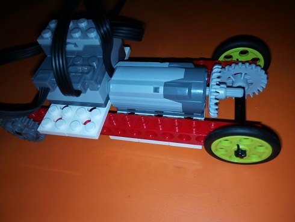
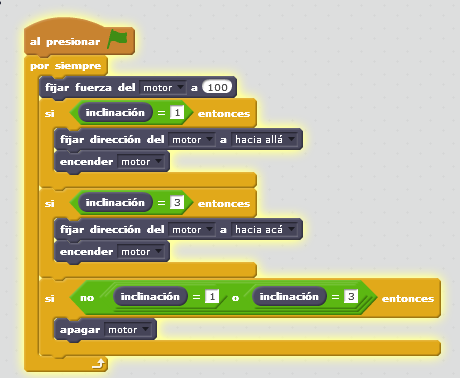
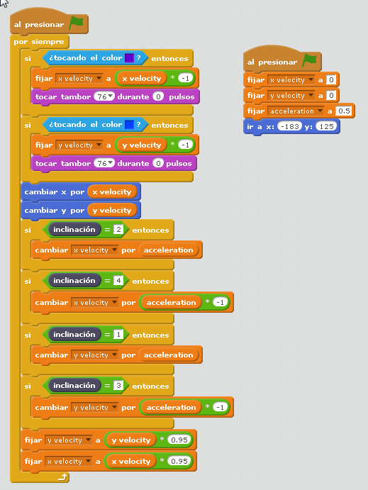

# Más del sensor inclinación

## Continuamos

Se le puede sacar mucho juego a este sencillo sensor

## Propuesta

## Desafiando la gravedad

Podemos hacer un coche, con el sensor de inclinación, y según su valor, actúe en contra de la inclinación, es decir que si se le inclina hacia bajo, el coche quiere subir, y al revés:

https//www.youtube.com/watch?v=W_NCek-rD28

Idea de [Labdocente](http://labdocente.pe/2016/01/23/robotica-con-lego-wedo-el-sensor-de-inclinacion/) 

Bueno, el coche es diseño casero, sin complicaciones, pues aquí el objetivo es la sencillez en construcción para enfocar nuestra atención en la programación:

%accordion%Solución%accordion%

La solución tiene que actuar el motor en tres casos:

- Cuando está inclinado hacia abajo, tiene que moverse hacia un sentido
- Cuando está inclinado hacia arriba tiene que moverse hacia el otro sentido
- Cuando no está inclinado hacia arriba o hacia abajo tiene que estar quieto

[Aquí si te lo quieres descargar](http://aularagon.catedu.es/materialesaularagon2013/LegoWedo/M3/contralagravedad.sb2) (sb2 - 54.02 <abbr lang="en" title="KiloBytes">KB</abbr>).

%/accordion%

## Propuesta

El siguiente programa es muy avanzado, pero nos da idea de las posibilidades del sensor de inclinación Lego WeDo

https//www.youtube.com/watch?v=q6d9vtaSGgA

%accordion%Solución%accordion%

En el siguiente [enlace](https://scratch.mit.edu/projects/583760/) o bien [en este archivo](http://aularagon.catedu.es/materialesaularagon2013/LegoWedo/M3/laberinto.sb2) (sb2 - 82651 <abbr lang="en" title="Bytes">B</abbr>).

<iframe width="485" height="402" allowtransparency="true" src="//scratch.mit.edu/projects/watch?v=583760/?autostart=false" frameborder="0" allowfullscreen=""></iframe>
El programa principal lo tiene la pelota que interactua con el laberinto de color azul, luego según el sensor de inclinación y según toque el color azul, cambia los valores de velocidad:

%/accordion%