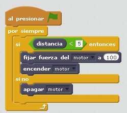

# Peonza

## Objetivos

La peonza inteligente es un buen ejemplo de cómo la tecnología puede facilitar la ejecución de algo manual

- Utilización del sensor distancia
- Cálculo de la distancia de forma experimental para su ejecución
- Motor y engranaje multiplicador para el aumento de la velocidad de rotación

## Construcción

En formato [PDF en este enlace](http://ro-botica.com/pdf/WeDo/Smart%20Spinner.pdf) y también en[ Dropbox ](https://www.dropbox.com/s/pzokn7pjiuxr2gh/PEONZA.pdf?dl=0)

## Propuesta

La peonza tiene que girar cuando la distancia sea tal que detecte que esta encima de una superficie

https//www.youtube.com/watch?v=aSZFzGtTetg

%accordion%Solución%accordion%

El valor de 5 es arbritario, es la distancia tal que detecte que hay una superficie para rodar la peonza

%/accordion%

## Otras propuestas

Es que interactue con elementos del Scratch como vemos en el vídeo

https//www.youtube.com/watch?v=pZGX6fgNY7k
