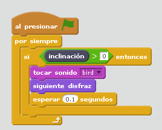

# Pájaro

## Objetivo

El principal objetivo de esta actividad es interactuar con el sensor de inclinación, su respuesta tiene que ser en algún objeto de Scratch pues esta construcción carece de motor.

## Construcción

Aquí lo tienes en [formato PDF](http://ro-botica.com/pdf/WeDo/Flying%20Bird.pdf) o en [Dropbox](https://www.dropbox.com/s/pqgn8qoujh9dvua/PAJARO.pdf?dl=0)

## Propuesta

Nuestra propuesta es una interacción con sonido y con disfraz del objeto en Scratch:

https//www.youtube.com/watch?v=Yb4DpYhfSaY

%accordion%Solución%accordion%

Aquí el programa para descargar en formato Scratch [pajaro.sb2](http://aularagon.catedu.es/materialesaularagon2013/LegoWedo/M2/pajaro.sb2)

%/accordion%