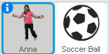
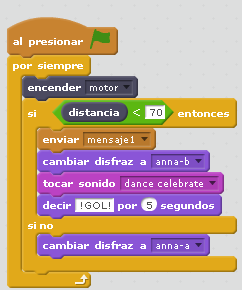
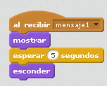
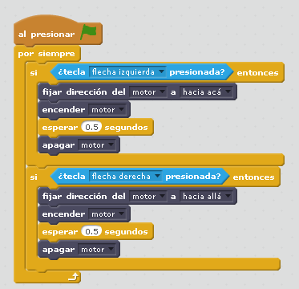

# Portero

## Objetivo

Esta construcción trabaja muy bien la gamificación: la temática del futbol es una buena motivación y las posibilidades son varias fomentando la creatividad.

- Transmisión: Se transforma el movimiento rotatorio del motor en un movimiento alternante del portero
- Sensor distancia como detector de eventos: El gol
- Interacción con Scratch

## Construcción

Aquí en [formato PDF](http://ro-botica.com/pdf/WeDo/Goal%20Keeper.pdf) o en [Dropbox](https://www.dropbox.com/s/r4pc6fv9u7aq03h/PORTERO.pdf?dl=0)

## Propuesta

- Si marcas un gol, el personaje de Scratch cambia de disfraz (la chica cambia de las manos bajadas a las manos subidas)
- También si marcas un gol, la chica dice **gol** y suena una música
Podemos introducir programación un poco más avanzada, con envío de mensajes de objetos a otros:
<ul>
- Si marca gol, se muestra una pelota durante unos segundos

https//www.youtube.com/watch?v=tRoNmoAuG2I
Ampliación: Poner un marcador (variable que contabilice los goles)

<input type="button" name="toggle-feedback-16_93" value="Solución" class="feedbackbutton" onclick="$exe.toggleFeedback(this,false);return false" />

### Retroalimentación

[Aquí tienes el programa descargado](portero.sb2) (sb2 - 145643 <abbr lang="en" title="Bytes">B</abbr>). en formato sb2

Son dos objetos, la chica (que tiene dos disfraces) y la pelota:

La chica tiene el programa principal, y envía un mensaje:

El mensaje es recogido por el objeto pelota que tiene este programa:

## Otra propuesta

Otra propuesta es que el portero se mueva según las fechas izquierda y derecha, de esta manera juegan dos jugadores

https//www.youtube.com/watch?v=7z6DfSoyKLA
<input type="button" name="toggle-feedback-18_93" value="Solución" class="feedbackbutton" onclick="$exe.toggleFeedback(this,false);return false" />

### Retroalimentación

Aquí en vez de mover contínuamente el portero, es según las flechas:

El programa te lo puedes [descargar aquí](portero_PARA_2_PERSONA_copy.sb2) (sb2 - 145712 <abbr title="Bytes" lang="en">B</abbr>).

## Reflexión

## Y si tuvieramos dos Lego Wedo

Uno el portero, y otro dispara !

https//www.youtube.com/watch?v=UVWlL5hi33U
