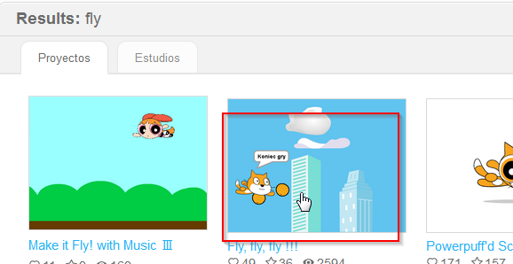

# Reinventar

Es una buena ocasión para explicar los conceptos de **compartir código, software libre,...** y como todos nos beneficiamos de los pasos creativos de todos gracias a compartir libremente en beneficio de todos.

## Propuesta

## Objetivo

Reutilizar código ya creado, interpretarlo y reinventarlo utilizando nuestro sensor distancia LEGO WEDO

## Búsqueda

Vamos a buscar algún juego sencillo, por ejemplo el típico de vuelo esquivando objetos, para ello buscamos en Scratch con la palabra clave ****fly** **(siempre se tienen mejores búsquedas en inglés que en español, aquí podemos educar en el concepto de la **globalización** y la importancia del conocimiento de las lenguas extranjeras.

elegimos alguna propuesta interesante:

Corresponde al siguiente proyecto:

[https://scratch.mit.edu/projects/113582791/](https://scratch.mit.edu/projects/113582791/)

<iframe width="485" height="402" allowtransparency="true" src="//scratch.mit.edu/projects/watch?v=113582791/?autostart=false" frameborder="0" allowfullscreen=""></iframe>

## Propuesta

Se nos ocurre que en vez que el gato suba o baje según la posición del ratón, que sea con nuestro sensor distancia de LEGO WEDO :

https//www.youtube.com/watch?v=tvcSWZ_IWMI

%accordion%Solución%accordion%

Entramos en el código y lo interpretamos, localizamos la parte responsable del movimiento del gato :

sustituimos ese código por nuestro sensor distancia

ATENCIÓN hay que hacer algo de matemáticas:

Si nuestro sensor distancia va desde 0 a 100 y el gato tiene que ir desde -150 a 150 (esto se ve moviéndolo, y abajo se visualizan las coordenadas) entonces ¿qué código hay que poner? como siempre es una recta:

y = m + n*distancia

Si distancia=0 y tiene que ser 150 luego m=150 Si distancia =100 y tiene -150 luego n=-3

Solución y = 150-3*distancia

(También podría ser al revés que cuando distancia=0, y=-150 y cuando distancia=100 y=150 entonces y=3*distancia-150)

La solución se puede [descargar aquí](fly.sb2) (sb2 - 145.97 <abbr lang="en" title="KiloBytes">KB</abbr>).

Se puede seguir modificando el código, por ejemplo traducir los mensajes, subir las vidas ...

%/accordion%

