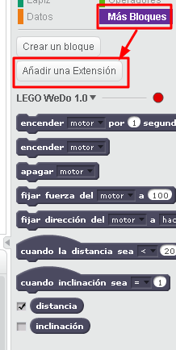

# Scratch y LegoWeDo

LEGO® WEDO permite su programación de dos formas:

- Software propio[ LEGO Wedo](http://www.ro-botica.com/Producto/Software-LEGO-Education-WeDo-y-12-actividades/)
- Enlazado con [**SCRACTH**](https://scratch.mit.edu/)

A pesar de que el software propio es muy intuitivo, EN ESTE CURSO NO LO LO UTILIZAREMOS, pues consideramos la opción de utilizar** Lego WEDO con Scracth** ([desarrollada por el mimo equipo de Scratch](http://scratched.gse.harvard.edu/resources/wedo-and-scratch)) **ES LA OPCIÓN MÁS RECOMENDADA pues utilizamos **

- **un software libre**
- **un lenguage genérico y universal**
<li>**ofrece muchas más posibilidades**
<ul>
- principalmente la interacción de nuestro Lego Wedo con los objetos de Scratch

## Cómo enlazar LEGO WEDO con Scratch

Lo primero que tenemos que hacer es **registrarnos en Scratch**. A pesar de que esto pertenece al curso de Scratch, aquí tienes un pequeño tutorial de cómo registrarse [[en Flash](http://aularagon.catedu.es/materialesaularagon2013/LegoWedo/Videos/RegistrarseScratch.htm)] o [[en PDF](http://aularagon.catedu.es/materialesaularagon2013/LegoWedo/Videos/RegistraseScractch.pdf)]

- Si utilizas Firefox y es la primera vez que entras en Scratch, es posible que te pida** INSTALAR ADOBE FLASH PLAYER**
<li>¿Podríamos utilizar LEGO WEDO en Scratch sin registrarnos? Sí, pero el inconveniente es que no se te grabarían los proyectos, tendrías que descargártelos en tu ordenador para poderlos reutilizar, lo mejor es registrarse, y para ello hay que utilizar un correo electrónico.
<ul>
- Recuerda que [un menor de 16 años no puede tener correo electrónico](https://support.google.com/accounts/answer/1350409?hl=es), pero un mayor o el colegio sí, y facilitar el acceso, tal y como se hace en [Google Apss for Education](https://www.google.com/edu/)

Lo segundo, una vez registrados, tenemos que hacer:

- Si es la primera vez: **Instalar el plugin** de LegoWedo (si además utilizamos Google Chrome, el plugin para él) 
- Si ya lo hemos instalado los plugins, sólo tenemos que entrar en **Más bloques - Añadir una extensión** **- LEGO WEDO 1.0**, como ya hemos instalado los plugings, a funcionar!!!

Esto se ve mejor con un breve tutorial [[en Flash] ](http://aularagon.catedu.es/materialesaularagon2013/LegoWedo/Videos/Lego-wedo.htm)o [[en PDF](http://aularagon.catedu.es/materialesaularagon2013/LegoWedo/Videos/Lego-wedo.pdf)]

O aquí en forma de video

https//www.youtube.com/watch?v=XXQmcl9AK8s

