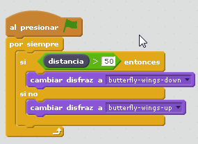
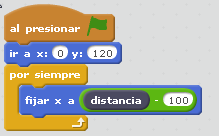

# Sensor distancia

## Propuesta

La propuesta es realizar un personaje en Scratch que sea una mariposa, con dos disfraces: Alas arriba y alas abajo (en la biblioteca tienes uno predeterminado : **Butterfly1**

Esta mariposa tiene que cambiar de disfraz según el valor del sensor de distancia (que podemos fijarlo de 0-50 alas arriba y de 50-100 alas abajo por ejemplo)

https//www.youtube.com/watch?v=6oyyXk2ijxM
<input type="button" name="toggle-feedback-7_93" value="Solución" class="feedbackbutton" onclick="$exe.toggleFeedback(this,false);return false" />

### Retroalimentación

- [En este enlace](https://scratch.mit.edu/projects/1789931/) aunque algunos bloques hay que sustituirlos por el equivalente en castellano
- [En este archivo](mariposa2.sb2) (sb2 - 38.27 <abbr lang="en" title="KiloBytes">KB</abbr>). (corregido lo anterior)
- O aquí embebido:

<iframe width="485" height="402" allowtransparency="true" src="//scratch.mit.edu/projects/watch?v=1789931/?autostart=false" frameborder="0" allowfullscreen=""></iframe>

Fuera de la propuesta, el ejemplo tenía una barra azul que visualiza la posición del sensor a distancia, su código es el siguiente:

