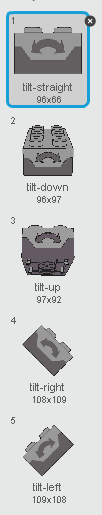

# Sensor inclinación

## Lo sencillo a veces es más didáctico

Vamos a ver unos ejemplos de que no es necesario hacer construcciones para realizar unos buenos retos de programación. LEGO WEDO tiene unos estupendos sensores de inclinación y de distancia que pueden darnos mucho juego con Scratch, incluso sin crear objetos nuevos, utilizando los de la bibliteca predeterminada.

En estos ejemplos, el objetivo no es la creatividad de la construcción, sino el** pensamiento computacional**, la programación, la lógica matemática !!

## Propuesta

Que se mueva la mariposa en función del sensor de inclinación de derecha a izquierda tal y como se muestra en el vídeo. La mariposa es de la biblioteca predeterminada de objetos de Scratch:

https//www.youtube.com/watch?v=RiyhrOUkjmc

%accordion%Solución%accordion%

- [En este enlace](https://scratch.mit.edu/projects/1789934/) pero algunos componentes no corresponden al equivalente castellano y hay que cambiarlos.
- [En este archivo](http://aularagon.catedu.es/materialesaularagon2013/LegoWedo/M3/mariposa-inclinacion.sb2) (sb2 - 49.74 <abbr lang="en" title="KiloBytes">KB</abbr>)., corregido lo anterior.
- o aquí embebido:

<iframe width="485" height="402" allowtransparency="true" src="//scratch.mit.edu/projects/watch?v=1789934/?autostart=false" frameborder="0" allowfullscreen=""></iframe>

el sensor (es una chorrada, pero queda guay) tiene este código

y el sensor tiene los apropiados disfraces:

%/accordion%